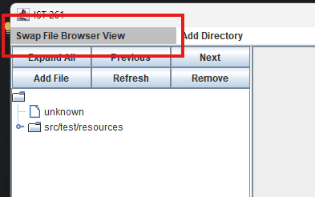
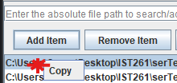

# M08-A01 Implementing a LinkedList
The following details the approaches taken to attempt to satisfy the canvas rubric for the assignment. 
To motivate this assignment, a linked list backs an alternative browser to the tree-based one in place and can be accessed by clicking the following button: 
 
You may <u>right click</u> a selection in the list to copy its file path and right click in the text field to paste for ease of testing since absolute file paths are required. 

## Instantiate the class containing the LinkedList in the main method
The class used is [SortedFileList.java](src/main/java/model/data/SortedFileList.java) and its primary linked list for this exercise is <code>private ArrayList<String> absoluteFilePaths;</code> 
The class has been instantiated in [SortedFileBrowserJPanelController.java](controller/filebrowser/SortedFileBrowserJPanelController.java) instead of the main method as the current structure of this project and how this list is used would necessitate the passing around of many mode/view/controller classes.

## The constructor in the LinkedList class should call a method to build a list of test data. These should be added to the LinkedList in sorted order
[SortedFileList.java](src/main/java/model/data/SortedFileList.java) 
<code>public void buildTestData()</code> attempts to satisfy this requirement by adding the contents of <code>serTest</code> & <code>src/test/resources</code>. 
<code>public void sortFiles()</code> leverages the collections framework built in sorting method to lexically sort the file labels in these lists and is called immediately after test data is added.

## After building the test data for the LinkedList, the constructor should call a method to print the items in the list to the command line

[SortedFileList.java](src/main/java/model/data/SortedFileList.java) 
<code>public void printToCommandLine()</code> lists the contents of the LinkedList to the console. It is called at instantiation & can be called via a button in the GUI.

## LinkedList class includes the method - addItem(Object newObject)

[SortedFileList.java](src/main/java/model/data/SortedFileList.java) 
<code>public void addItem(String newItem)</code> modifies the model object / linked lists containing sorted strings representing entries in the browser list. A GUI button is used to trigger this method.

[SortedFileBrowserJPanelController](src/main/java/controller/filebrowser/SortedFileBrowserJPanelController.java) 
<code>public ActionListener addItem()</code> defines the action listener for the GUI button allowing item addition to the list. The list is re-sorted upon addition.

## LinkedList class includes the method - removeItem(Object objectToRemove)

[SortedFileList.java](src/main/java/model/data/SortedFileList.java) 
<code>public void removeItem(String itemToRemove)</code> modifies the model object / linked lists containing sorted strings representing entries in the browser list. A GUI button is used to trigger this method.

[SortedFileBrowserJPanelController](src/main/java/controller/filebrowser/SortedFileBrowserJPanelController.java) 
<code>public ActionListener removeItem()</code> defines the action listener for the GUI button allowing item removal from the list. The list is re-sorted upon removal.

## LinkedList class includes the method - getItem(String searchTerm)

[SortedFileList.java](src/main/java/model/data/SortedFileList.java) 
<code>public String getItem(String searchTerm)</code> returns a boolean flag to confirm the searched object exists within the model.

[SortedFileBrowserJPanelController](src/main/java/controller/filebrowser/SortedFileBrowserJPanelController.java) 
<code>public ActionListener searchItem()</code> reads the requested search term, checks with the model that it exists, then (if it does) shifts the JList selection to make the requested file the active file in the GUI.

## After instantiating the LinkedList, in the main method call the three methods above to add, remove, and get an item in your LinkedList.

[Main.java](src/main/java/Main.java) 
Three correspondingly named methods are called in the main method to add, remove, and get an item in the LinkedList.
The results of each action are printed to the terminal by making calls to the <code>.contains()</code> method of the LinkedList.